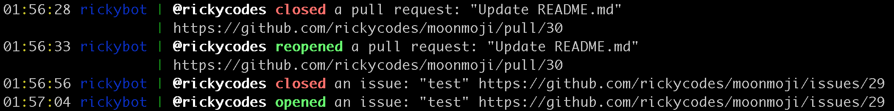

# probot-irc

> A GitHub App built with [Probot](https://github.com/probot/probot) that creates a _very_ humble (super beta right now) irc bot that announces repo activity in a channel:



## Setup

```sh
# Install dependencies
npm install

# Run the bot
npm start
```

## Contributing

If you have suggestions for how probot-irc could be improved, or want to report a bug, open an issue! We'd love all and any contributions.

For more, check out the [Contributing Guide](CONTRIBUTING.md).

## License

[ISC](LICENSE) © 2018 rickycodes <ricky.miller@gmail.com>
